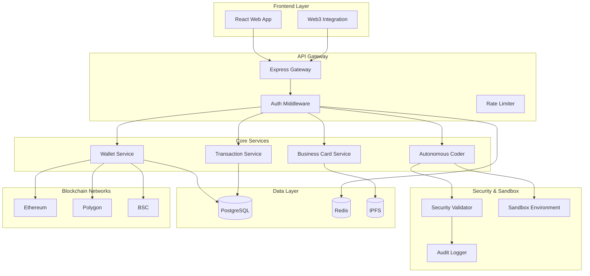

# Design Document: Blockchain Wallet Platform

## Overview

The Blockchain Wallet Platform is a comprehensive web3 application that combines secure non-custodial wallet functionality with digital business cards and an autonomous coding system. The platform leverages Google OAuth for seamless authentication, automatically provisions blockchain accounts, and maintains transaction persistence across sessions. A key innovation is the integrated autonomous coding system that can generate, test, and deploy production-grade code within a secure sandbox environment.

The architecture follows a microservices pattern with clear separation of concerns between authentication, wallet management, blockchain interactions, and autonomous development operations. All components are designed with security-first principles, ensuring user private keys never leave their devices while maintaining comprehensive audit trails for compliance.

## Architecture

The platform employs a layered architecture with the following key layers:

**Presentation Layer**: React-based frontend with Web3 integration, providing intuitive interfaces for wallet operations, business card management, and autonomous coding controls.

**API Gateway Layer**: Express.js-based API gateway handling authentication, request routing, rate limiting, and security validation.

**Service Layer**: Microservices for core business logic including wallet operations, transaction management, business card services, and autonomous coding orchestration.

**Data Layer**: Distributed data storage using PostgreSQL for user data and transaction history, Redis for session management, and IPFS for decentralized business card storage.

**Blockchain Layer**: Multi-chain integration supporting Ethereum, Polygon, and other EVM-compatible networks through standardized interfaces.

**Security Layer**: Comprehensive security controls including input validation, authentication verification, sandbox isolation, and audit logging.



## Components and Interfaces

### Authentication Service

The Authentication Service manages Google OAuth integration and user session lifecycle.

**Core Interface:**
```
AuthService {
  authenticateWithGoogle(authCode: string): Promise<AuthResult>
  validateSession(sessionToken: string): Promise<UserSession>
  refreshSession(refreshToken: string): Promise<AuthResult>
  logout(sessionToken: string): Promise<void>
  createBlockchainAccount(userId: string): Promise<AccountInfo>
}
```

**Key Responsibilities:**
- OAuth flow management with Google Identity Platform
- JWT token generation and validation
- Session persistence in Redis with configurable TTL
- Automatic blockchain account provisioning for new users
- Security event logging and suspicious activity detection

### Wallet Service

The Wallet Service provides non-custodial wallet functionality with client-side key management.

**Core Interface:**
```
WalletService {
  generateWallet(): Promise<WalletInfo>
  importWallet(privateKey: string): Promise<WalletInfo>
  signTransaction(transaction: Transaction, privateKey: string): Promise<SignedTransaction>
  estimateGas(transaction: Transaction): Promise<GasEstimate>
  getBalance(address: string, network: string): Promise<Balance>
}
```

**Security Features:**
- Private keys never transmitted or stored server-side
- Client-side key derivation using industry-standard algorithms
- Hardware wallet integration support (Ledger, Trezor)
- Multi-signature wallet support for enhanced security
- Encrypted local storage with user-controlled passwords

### Transaction Manager

The Transaction Manager handles blockchain transaction lifecycle and persistence.

**Core Interface:**
```
TransactionManager {
  submitTransaction(signedTx: SignedTransaction): Promise<TransactionResult>
  getTransactionHistory(userId: string): Promise<Transaction[]>
  monitorTransaction(txHash: string): Promise<TransactionStatus>
  estimateFees(network: string): Promise<FeeEstimate>
  cancelTransaction(txHash: string, newGasPrice: number): Promise<TransactionResult>
}
```

**Features:**
- Real-time transaction monitoring with WebSocket updates
- Cross-chain transaction support with unified interface
- Transaction queuing and batch processing for efficiency
- MEV protection through private mempool integration
- Comprehensive transaction analytics and reporting

### Business Card System

The Business Card System enables creation and verification of blockchain-based digital business cards.

**Core Interface:**
```
BusinessCardSystem {
  createCard(cardData: BusinessCardData): Promise<CardCreationResult>
  shareCard(cardId: string): Promise<ShareableLink>
  verifyCard(cardId: string): Promise<VerificationResult>
  updateCard(cardId: string, updates: Partial<BusinessCardData>): Promise<UpdateResult>
  getCardHistory(cardId: string): Promise<CardVersion[]>
}
```

**Blockchain Integration:**
- IPFS storage for card metadata with content addressing
- Ethereum-based smart contract for ownership verification
- Digital signatures for authenticity proof
- Version control with immutable history tracking
- QR code generation for easy sharing

### Autonomous Coding System

The Autonomous Coding System provides AI-powered code generation with safety controls.

**Core Interface:**
```
AutonomousCoder {
  generateCode(specification: CodeSpec): Promise<GenerationResult>
  runTests(codebase: string): Promise<TestResult>
  fixFailures(failures: TestFailure[]): Promise<FixResult>
  validateSecurity(code: string): Promise<SecurityReport>
  deployToSandbox(code: string): Promise<DeploymentResult>
}
```

**Safety Mechanisms:**
- Sandboxed execution environment with resource limits
- Static code analysis for security vulnerabilities
- Automated test generation and execution
- Code quality metrics and compliance checking
- Human approval gates for production deployment

## Data Models

### User Model

```
User {
  id: UUID (primary key)
  googleId: string (unique)
  email: string
  name: string
  profilePicture: string
  blockchainAddress: string
  createdAt: timestamp
  lastLoginAt: timestamp
  preferences: UserPreferences
  status: UserStatus
}

UserPreferences {
  defaultNetwork: string
  gasPreference: GasPreference
  notificationSettings: NotificationSettings
  securitySettings: SecuritySettings
}
```

### Transaction Model

```
Transaction {
  id: UUID (primary key)
  userId: UUID (foreign key)
  txHash: string (unique)
  fromAddress: string
  toAddress: string
  amount: BigNumber
  gasUsed: number
  gasPrice: BigNumber
  network: string
  status: TransactionStatus
  blockNumber: number
  timestamp: timestamp
  metadata: TransactionMetadata
}

TransactionMetadata {
  type: TransactionType
  contractAddress?: string
  functionCall?: string
  tokenSymbol?: string
  usdValue?: number
}
```

### Business Card Model

```
BusinessCard {
  id: UUID (primary key)
  ownerId: UUID (foreign key)
  ipfsHash: string
  blockchainTxHash: string
  name: string
  title: string
  company: string
  email: string
  phone: string
  website: string
  socialLinks: SocialLink[]
  createdAt: timestamp
  updatedAt: timestamp
  version: number
  isActive: boolean
}

SocialLink {
  platform: string
  url: string
  verified: boolean
}
```

### Autonomous Code Session Model

```
CodeSession {
  id: UUID (primary key)
  userId: UUID (foreign key)
  specification: string
  generatedCode: string
  testResults: TestResult[]
  securityReport: SecurityReport
  status: SessionStatus
  createdAt: timestamp
  completedAt?: timestamp
  sandboxId: string
  deploymentUrl?: string
}

TestResult {
  testName: string
  status: TestStatus
  duration: number
  errorMessage?: string
  coverage: number
}
```

Now I need to use the prework tool to analyze acceptance criteria before writing correctness properties:

<function_calls>
<invoke name="prework">
<parameter name="featureName">blockchain-wallet-platform

## Correctness Properties

*A property is a characteristic or behavior that should hold true across all valid executions of a system—essentially, a formal statement about what the system should do. Properties serve as the bridge between human-readable specifications and machine-verifiable correctness guarantees.*

Based on the prework analysis, I've identified several redundant properties that can be consolidated:

**Property Reflection:**
- Properties 3.1 and 3.2 (transaction metadata recording and status updates) can be combined into a comprehensive transaction lifecycle property
- Properties 2.2 and 2.3 (private key security) can be combined into a single comprehensive security property
- Properties 6.2 and 6.3 (session clearing) can be combined into a single session cleanup property
- Properties 7.2, 7.3, and 7.4 (autonomous coding test cycle) can be combined into a single comprehensive test-fix cycle property
- Properties 9.1, 9.2, and 9.3 (security validation) can be combined into a comprehensive security validation property

### Authentication Properties

**Property 1: Automatic blockchain account creation**
*For any* new user completing Google OAuth successfully, the platform should automatically create a unique blockchain account and associate it with their user profile.
**Validates: Requirements 1.2**

**Property 2: Session data restoration**
*For any* returning user logging in, the platform should restore their complete blockchain account information and transaction history from previous sessions.
**Validates: Requirements 1.3**

**Property 3: Credential isolation**
*For any* authentication operation, the stored user data should contain only necessary identification information and never include Google OAuth credentials or tokens.
**Validates: Requirements 1.5**

### Wallet Security Properties

**Property 4: Client-side key generation**
*For any* new wallet creation, the private key should be generated locally in the user's browser and never transmitted to or stored on any server.
**Validates: Requirements 2.1**

**Property 5: Private key security invariant**
*For any* platform operation involving private keys, the keys should remain exclusively on the client side and never be accessible to server-side components or network traffic.
**Validates: Requirements 2.2, 2.3**

**Property 6: Memory cleanup on logout**
*For any* user logout operation, all private key material should be securely cleared from browser memory and local storage.
**Validates: Requirements 2.4**

### Transaction Management Properties

**Property 7: Transaction lifecycle tracking**
*For any* transaction from initiation to completion, the system should record all metadata at initiation and update status with blockchain confirmation details upon completion.
**Validates: Requirements 3.1, 3.2**

**Property 8: Transaction history persistence**
*For any* user session restoration, all previously recorded transaction history should be available regardless of browser sessions or device changes.
**Validates: Requirements 3.3, 3.4**

**Property 9: Transaction display completeness**
*For any* transaction history display, all transactions should show status, amounts, addresses, and timestamps.
**Validates: Requirements 3.5**

### Business Card Properties

**Property 10: Blockchain storage consistency**
*For any* business card creation, the card data should be stored on the blockchain and retrievable via the blockchain transaction hash.
**Validates: Requirements 4.1**

**Property 11: Verifiable sharing links**
*For any* business card sharing operation, the generated link should contain blockchain proof that can be independently verified.
**Validates: Requirements 4.2**

**Property 12: Signature verification**
*For any* business card reception, the platform should verify the blockchain signature and display the correct verification status.
**Validates: Requirements 4.3**

**Property 13: Version history maintenance**
*For any* business card update, a new blockchain entry should be created while preserving the complete version history of previous entries.
**Validates: Requirements 4.5**

### Blockchain Interface Properties

**Property 14: Gas estimation accuracy**
*For any* transaction cost estimation, the calculated gas fees should be within 5% of the actual network fees at execution time.
**Validates: Requirements 5.2**

**Property 15: Network broadcasting**
*For any* transaction submission, the transaction should be successfully broadcast to the correct blockchain network as specified by the user.
**Validates: Requirements 5.3**

**Property 16: Real-time status updates**
*For any* transaction being monitored, status updates should be provided within 30 seconds of blockchain state changes.
**Validates: Requirements 5.4**

### Session Management Properties

**Property 17: Secure session creation**
*For any* user login, a secure session should be created with appropriate timeout configuration and security headers.
**Validates: Requirements 6.1**

**Property 18: Session cleanup invariant**
*For any* session termination (expiration or manual logout), all session data should be securely cleared from both client and server storage.
**Validates: Requirements 6.2, 6.3**

**Property 19: Preference persistence**
*For any* user session, non-sensitive preferences and transaction history should persist across logout/login cycles.
**Validates: Requirements 6.4**

**Property 20: Suspicious activity response**
*For any* detected suspicious activity, the platform should automatically terminate the session and require re-authentication.
**Validates: Requirements 6.5**

### Autonomous Coding Properties

**Property 21: Autonomous code generation**
*For any* auto-mode enabled operation, production-grade code should be generated without requiring human approval during the generation process.
**Validates: Requirements 7.1**

**Property 22: Comprehensive test-fix cycle**
*For any* code generation operation, the system should automatically run tests, analyze failures, generate fixes, and continue this cycle until all tests pass.
**Validates: Requirements 7.2, 7.3, 7.4**

**Property 23: Security validation gate**
*For any* completed code generation, security validation should be performed and must pass before any deployment is allowed.
**Validates: Requirements 7.5**

### Sandbox Security Properties

**Property 24: Operation isolation**
*For any* autonomous coding operation, the sandbox should completely isolate the operation from production systems, databases, and external services.
**Validates: Requirements 8.1, 8.3**

**Property 25: Destructive operation blocking**
*For any* attempted destructive operation within the sandbox, the operation should be blocked and logged with detailed information.
**Validates: Requirements 8.2**

**Property 26: Resource limit enforcement**
*For any* sandbox operation exceeding defined limits, the operation should be terminated and administrators should be alerted.
**Validates: Requirements 8.4**

### Security Validation Properties

**Property 27: Comprehensive security scanning**
*For any* generated code, the security validator should scan for vulnerabilities, validate input sanitization, check authentication controls, and block deployment if issues are found.
**Validates: Requirements 9.1, 9.2, 9.3**

**Property 28: Blockchain-specific security checks**
*For any* blockchain-related code validation, the system should specifically check for reentrancy attacks and overflow conditions.
**Validates: Requirements 9.4**

**Property 29: Security audit trail**
*For any* security validation operation, a complete audit trail should be maintained with all findings and decisions.
**Validates: Requirements 9.5**

### Quality Assurance Properties

**Property 30: Code quality standards**
*For any* generated code, the system should enforce consistent formatting, ensure minimum 80% test coverage, and validate documentation completeness.
**Validates: Requirements 10.1, 10.2, 10.3**

**Property 31: Complexity management**
*For any* code exceeding complexity thresholds, the autonomous coder should automatically refactor for simplicity.
**Validates: Requirements 10.4**

**Property 32: Performance validation**
*For any* generated code, performance benchmarks should be generated and validated against established baselines.
**Validates: Requirements 10.5**

### Audit and Compliance Properties

**Property 33: Authentication event logging**
*For any* user authentication event, the system should log the event with timestamp, IP address, and outcome.
**Validates: Requirements 11.1**

**Property 34: Immutable transaction audit**
*For any* blockchain transaction, an immutable audit record should be created and maintained.
**Validates: Requirements 11.2**

**Property 35: Autonomous operation tracking**
*For any* autonomous coding operation, complete change history should be tracked and maintained.
**Validates: Requirements 11.3**

**Property 36: Security incident reporting**
*For any* security event, detailed incident reports should be automatically generated.
**Validates: Requirements 11.4**

## Error Handling

The platform implements comprehensive error handling across all layers with the following strategies:

**Authentication Errors:**
- OAuth failures trigger user-friendly error messages with retry mechanisms
- Session timeouts provide graceful degradation with automatic re-authentication prompts
- Invalid tokens result in secure session termination and cleanup

**Blockchain Errors:**
- Network connectivity issues trigger automatic retry with exponential backoff
- Transaction failures provide detailed error analysis and suggested remediation
- Gas estimation errors fall back to conservative estimates with user warnings

**Autonomous Coding Errors:**
- Code generation failures trigger automatic alternative approach attempts
- Test failures initiate the automated fix cycle with detailed failure analysis
- Security validation failures block deployment with comprehensive reporting

**Sandbox Errors:**
- Resource limit violations trigger graceful termination with state preservation
- Isolation breaches result in immediate sandbox reset and security alerts
- Destructive operation attempts are logged and blocked with administrator notification

**Data Persistence Errors:**
- Database connectivity issues trigger local caching with eventual consistency
- IPFS storage failures fall back to redundant storage providers
- Session data corruption triggers secure re-initialization

## Testing Strategy

The platform employs a dual testing approach combining unit tests for specific scenarios with property-based tests for comprehensive coverage.

**Property-Based Testing Configuration:**
- Minimum 100 iterations per property test to ensure statistical confidence
- Each property test references its corresponding design document property
- Tag format: **Feature: blockchain-wallet-platform, Property {number}: {property_text}**
- Property tests use QuickCheck.js for JavaScript/TypeScript components

**Unit Testing Focus:**
- Authentication flow edge cases and error conditions
- Wallet integration with specific hardware devices
- Business card creation with various data formats
- Autonomous coding system integration points
- Security validation with known vulnerability patterns

**Integration Testing:**
- End-to-end user workflows from authentication to transaction completion
- Cross-chain transaction scenarios with multiple blockchain networks
- Autonomous coding system with real code generation and deployment
- Security system integration with all platform components

**Security Testing:**
- Penetration testing of authentication and session management
- Blockchain transaction security with various attack vectors
- Sandbox escape attempt testing with malicious code patterns
- Private key security validation with memory analysis

**Performance Testing:**
- Load testing with concurrent user sessions and transactions
- Blockchain network performance under various network conditions
- Autonomous coding system performance with large codebases
- Database and IPFS storage performance under high load

**Compliance Testing:**
- Audit trail completeness and immutability verification
- Regulatory compliance validation for financial operations
- Data privacy compliance with GDPR and similar regulations
- Security standard compliance with industry frameworks