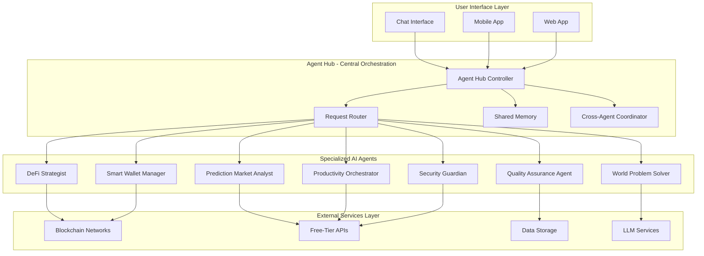

# Design Document: Autonomous Multi-Agent DeFi Automation System

## Overview

The Autonomous Multi-Agent AI System for DeFi Automation, Productivity Workflows & Web3 Orchestration represents a paradigm shift in how non-technical users interact with decentralized finance and solve real-world problems. This system addresses the critical challenge of AI agent isolation by creating a unified orchestration framework where seven specialized agents autonomously coordinate strategies, execute transactions, and provide world-class problem-solving capabilities through simple conversational interfaces.

The platform democratizes access to sophisticated financial automation, enabling anyone to benefit from advanced DeFi strategies, market intelligence, and productivity optimization without requiring technical expertise or cryptocurrency knowledge. By combining autonomous execution with human oversight, the system provides the perfect balance of automation and control.

## Architecture

### High-Level System Architecture

The system follows a distributed microservices architecture with a central Agent Hub orchestrating seven specialized AI agents. Each agent operates independently while maintaining seamless communication and coordination through the hub.



### Agent Hub Architecture

The Agent Hub serves as the central nervous system, implementing sophisticated orchestration patterns:

- **Request Routing**: Intelligent distribution of user requests to appropriate agents
- **Cross-Agent Communication**: Secure message passing and state synchronization
- **Conflict Resolution**: Automated resolution of agent disagreements with escalation protocols
- **Resource Management**: Optimal allocation of computational resources and API quotas
- **Learning Coordination**: Centralized learning from all agent interactions and outcomes

### Microservices Design

Each agent operates as an independent microservice with:
- Dedicated compute resources and memory
- Specialized knowledge bases and training data
- Independent API integrations and rate limiting
- Fault isolation and recovery mechanisms
- Horizontal scaling capabilities

## Components and Interfaces

### 1. Agent Hub Controller

**Purpose**: Central orchestration and coordination of all AI agents

**Key Components**:
- **Request Dispatcher**: Routes incoming requests to appropriate agents based on intent analysis
- **Agent Registry**: Maintains real-time status and capabilities of all agents
- **Workflow Engine**: Manages multi-agent workflows and task dependencies
- **Conflict Resolver**: Handles disagreements between agents using consensus algorithms
- **Performance Monitor**: Tracks agent performance and optimizes resource allocation

**Interfaces**:
```typescript
interface AgentHubController {
  routeRequest(request: UserRequest): Promise<AgentResponse>
  coordinateAgents(task: ComplexTask): Promise<CoordinatedResponse>
  resolveConflict(conflict: AgentConflict): Promise<Resolution>
  monitorPerformance(): AgentMetrics[]
  updateAgentCapabilities(agentId: string, capabilities: Capability[]): void
}
```

### 2. DeFi Strategist Agent

**Purpose**: Advanced DeFi strategy development, yield optimization, and market analysis

**Core Capabilities**:
- Real-time yield farming opportunity analysis across 50+ protocols
- Automated portfolio rebalancing based on risk-adjusted returns
- Cross-protocol arbitrage detection and execution
- Impermanent loss calculation and mitigation strategies
- Gas optimization and transaction batching

**Key Integrations**:
- DeFiLlama API for protocol TVL and yield data
- 1inch Fusion+ API for optimal swap routing
- Aave, Compound, Yearn Finance APIs for lending strategies
- Uniswap V3 API for liquidity provision optimization

**Decision Engine**:
```typescript
interface DeFiStrategist {
  analyzeYieldOpportunities(portfolio: Portfolio): YieldStrategy[]
  optimizePortfolio(currentPositions: Position[]): RebalanceStrategy
  detectArbitrageOpportunities(): ArbitrageOpportunity[]
  calculateRiskMetrics(strategy: Strategy): RiskAssessment
  executeStrategy(strategy: Strategy, approval: UserApproval): ExecutionResult
}
```

### 3. Smart Wallet Manager Agent

**Purpose**: Autonomous wallet operations, transaction execution, and account abstraction

**Advanced Features**:
- ERC-4337 account abstraction implementation
- Gasless transaction execution using paymasters
- Multi-signature and social recovery mechanisms
- Automated transaction batching and optimization
- Cross-chain bridge operations

**Security Protocols**:
- Multi-layer transaction validation
- Real-time fraud detection
- Emergency pause mechanisms
- Secure key management with MPC

**Interface**:
```typescript
interface SmartWalletManager {
  createSmartWallet(userAuth: AuthData): SmartWallet
  executeTransaction(tx: Transaction, gasless: boolean): TransactionResult
  batchTransactions(txs: Transaction[]): BatchResult
  enableSocialRecovery(guardians: Guardian[]): RecoverySetup
  bridgeAssets(fromChain: Chain, toChain: Chain, amount: Amount): BridgeResult
}
```

### 4. Prediction Market Analyst Agent

**Purpose**: Global trend analysis, market predictions, and economic intelligence

**Analysis Capabilities**:
- Macroeconomic indicator correlation analysis
- Geopolitical event impact assessment
- Social sentiment analysis from multiple sources
- Prediction market opportunity identification
- Risk-adjusted betting strategies

**Data Sources**:
- Polymarket, Augur, Gnosis prediction markets
- Economic calendars and central bank communications
- Social media sentiment analysis
- News and event correlation engines

**Interface**:
```typescript
interface PredictionMarketAnalyst {
  analyzeGlobalTrends(): TrendAnalysis
  identifyPredictionOpportunities(): PredictionOpportunity[]
  assessEventImpact(event: GlobalEvent): ImpactAssessment
  recommendPositions(opportunities: PredictionOpportunity[]): PositionRecommendation[]
  trackPredictionAccuracy(): AccuracyMetrics
}
```

### 5. Productivity Orchestrator Agent

**Purpose**: Real-world task automation and traditional finance integration

**Automation Capabilities**:
- Email and calendar management
- Bill payment automation
- Banking integration and cash flow optimization
- Investment account coordination
- Emergency fund management

**Integration Points**:
- Gmail, Outlook APIs for communication
- Banking APIs for account management
- Calendar APIs for scheduling
- Payment processors for bill automation

**Interface**:
```typescript
interface ProductivityOrchestrator {
  manageCommunications(preferences: CommPreferences): CommResult
  automatePayments(bills: Bill[]): PaymentResult
  optimizeCashFlow(accounts: Account[]): CashFlowStrategy
  coordinateInvestments(goals: InvestmentGoal[]): InvestmentPlan
  handleEmergencies(emergency: Emergency): EmergencyResponse
}
```

### 6. Security Guardian Agent

**Purpose**: Comprehensive security monitoring and threat protection

**Protection Layers**:
- Real-time transaction monitoring
- Smart contract vulnerability analysis
- Rug-pull and scam detection
- MEV protection implementation
- Emergency response protocols

**Security Integrations**:
- Forta Network for threat detection
- OpenZeppelin Defender for monitoring
- Tenderly for transaction simulation
- Multiple security APIs for consensus scoring

**Interface**:
```typescript
interface SecurityGuardian {
  monitorTransactions(wallet: Wallet): SecurityStatus
  analyzeSmartContract(contract: Contract): SecurityAssessment
  detectThreats(activity: Activity[]): ThreatAlert[]
  implementProtection(threat: Threat): ProtectionMeasure
  respondToEmergency(emergency: SecurityEmergency): EmergencyAction
}
```

### 7. Quality Assurance Agent

**Purpose**: Continuous system testing and reliability assurance

**Testing Capabilities**:
- Automated regression testing
- Performance monitoring and optimization
- API integration validation
- User experience testing
- Security audit automation

**Monitoring Systems**:
- Real-time performance metrics
- Error tracking and analysis
- User behavior analytics
- System health dashboards

**Interface**:
```typescript
interface QualityAssuranceAgent {
  runSystemTests(): TestResults
  monitorPerformance(): PerformanceMetrics
  validateIntegrations(): IntegrationStatus
  auditSecurity(): SecurityAudit
  optimizeSystem(metrics: Metrics): OptimizationPlan
}
```

### 8. World Problem Solver Agent

**Purpose**: Global challenge identification and solution recommendation

**Problem-Solving Capabilities**:
- Climate change impact analysis and solutions
- Economic inequality assessment and interventions
- Food security and agricultural optimization
- Energy crisis solutions and renewable investments
- Social impact measurement and optimization

**Solution Framework**:
- Problem identification using global data sources
- Solution mapping to available DeFi/crypto opportunities
- Impact measurement and tracking
- ROI calculation for social impact investments

**Interface**:
```typescript
interface WorldProblemSolver {
  identifyGlobalChallenges(): GlobalChallenge[]
  mapSolutions(challenge: GlobalChallenge): Solution[]
  recommendInvestments(solutions: Solution[]): ImpactInvestment[]
  measureImpact(investment: ImpactInvestment): ImpactMetrics
  optimizeForImpact(portfolio: Portfolio): ImpactOptimization
}
```

## Data Models

### Core Data Structures

#### User Profile
```typescript
interface UserProfile {
  id: string
  authData: AuthenticationData
  preferences: UserPreferences
  riskTolerance: RiskLevel
  investmentGoals: InvestmentGoal[]
  socialImpactPreferences: ImpactPreference[]
  learningProgress: LearningMetrics
  portfolioHistory: PortfolioSnapshot[]
}
```

#### Agent State
```typescript
interface AgentState {
  agentId: string
  status: AgentStatus
  currentTasks: Task[]
  performance: PerformanceMetrics
  learningData: LearningState
  resourceUsage: ResourceMetrics
  lastUpdate: timestamp
}
```

#### Strategy Execution
```typescript
interface StrategyExecution {
  strategyId: string
  type: StrategyType
  parameters: StrategyParameters
  expectedOutcome: Outcome
  actualOutcome?: Outcome
  riskAssessment: RiskMetrics
  approvalStatus: ApprovalStatus
  executionHistory: ExecutionStep[]
}
```

#### Cross-Agent Communication
```typescript
interface AgentMessage {
  fromAgent: string
  toAgent: string
  messageType: MessageType
  payload: any
  priority: Priority
  timestamp: timestamp
  correlationId: string
}
```

### Database Schema Design

#### User Data (Supabase PostgreSQL)
- User profiles and preferences
- Authentication and session data
- Portfolio snapshots and performance history
- Learning progress and personalization data

#### Agent State (MongoDB Atlas)
- Real-time agent status and metrics
- Task queues and execution history
- Cross-agent communication logs
- Performance analytics and optimization data

#### Market Data (Redis Cache)
- Real-time price feeds and market data
- Protocol TVL and yield information
- Prediction market odds and outcomes
- Economic indicators and trend data

#### Vector Embeddings (Qdrant)
- User conversation history embeddings
- Strategy similarity matching
- Market pattern recognition
- Personalization vectors

## Correctness Properties

*A property is a characteristic or behavior that should hold true across all valid executions of a system—essentially, a formal statement about what the system should do. Properties serve as the bridge between human-readable specifications and machine-verifiable correctness guarantees.*

Before defining the correctness properties, I need to analyze the acceptance criteria from the requirements to determine which ones are testable as properties, examples, or edge cases.

### Property 1: Multi-Agent Coordination and Collaboration
*For any* complex user request requiring multiple agents, the Agent_Hub should correctly route subtasks to appropriate agents based on expertise, facilitate cross-agent communication, and ensure agents reach consensus on optimal strategies.
**Validates: Requirements 1.2, 1.3**

### Property 2: Natural Language Understanding and Strategy Translation
*For any* plain English request about financial goals or life problems, the system should correctly interpret the intent and translate it into actionable DeFi strategies with simple explanations free of technical jargon.
**Validates: Requirements 2.1, 2.2, 2.3**

### Property 3: Global Analysis and Problem-Solution Mapping
*For any* global challenge or market condition, the Prediction_Market_Analyst and World_Problem_Solver should correctly identify opportunities and map them to appropriate DeFi solutions that users can participate in.
**Validates: Requirements 3.1, 3.2**

### Property 4: Testnet Learning and Safe Progression
*For any* DeFi operation, the system should first demonstrate it using testnet environments with free tokens, and only execute real transactions after explicit user approval.
**Validates: Requirements 4.1, 4.2, 4.3**

### Property 5: DeFi Strategy Optimization and Rebalancing
*For any* user portfolio and risk tolerance, the DeFi_Strategist should continuously identify optimal yield opportunities and automatically rebalance when better opportunities arise, considering all costs and market conditions.
**Validates: Requirements 5.1, 5.2**

### Property 6: Comprehensive Security Monitoring and Protection
*For any* transaction, protocol interaction, or market condition, the Security_Guardian should detect potential threats, automatically reject suspicious activities, and implement appropriate protective measures including emergency protocols.
**Validates: Requirements 6.1, 6.2, 15.1**

### Property 7: Productivity Task Automation
*For any* routine administrative task (email, calendar, bills, communications), the Productivity_Orchestrator should handle it correctly while coordinating with other agents for optimal cash flow and financial planning.
**Validates: Requirements 7.1**

### Property 8: Prediction Market Analysis and Opportunity Detection
*For any* prediction market platform and global event, the system should correctly analyze correlations, identify mispriced outcomes, and recommend high-confidence opportunities based on comprehensive analysis.
**Validates: Requirements 8.1, 8.2**

### Property 9: Continuous Quality Assurance and System Reliability
*For any* system component, API integration, or agent decision-making process, the Quality_Assurance_Agent should continuously test functionality, detect issues, and maintain system reliability.
**Validates: Requirements 9.1**

### Property 10: Comprehensive API Integration and Free-Tier Optimization
*For any* required external service (LLM, blockchain, market data, productivity), the system should maintain functional integrations using free-tier services with intelligent usage optimization and fallback mechanisms.
**Validates: Requirements 10.1, 10.2, 11.1, 13.1**

### Property 11: ESG Impact Identification and Social Investment
*For any* investment opportunity, the World_Problem_Solver should correctly identify ESG-focused protocols and social impact potential, enabling users to align investments with their values while achieving returns.
**Validates: Requirements 12.1**

### Property 12: Adaptive Learning and Personalization
*For any* user interaction and outcome, the system should learn from preferences, success patterns, and feedback to continuously improve recommendations and adapt to individual user needs.
**Validates: Requirements 1.4, 14.1**

### Property 13: Regulatory Compliance and Geographic Adaptation
*For any* user location and local regulations, the system should ensure all recommendations and available services comply with applicable laws and regulatory requirements.
**Validates: Requirements 16.1**

### Property 14: Scalable Architecture and Performance Optimization
*For any* system load and user demand, the microservices architecture should automatically scale using free-tier cloud services while maintaining performance and reliability.
**Validates: Requirements 17.1**

## Error Handling

### Agent-Level Error Handling

Each agent implements comprehensive error handling strategies:

**Graceful Degradation**:
- When primary APIs fail, agents automatically switch to backup services
- Reduced functionality modes when external services are unavailable
- Cached data utilization during service outages

**Error Recovery Protocols**:
- Automatic retry mechanisms with exponential backoff
- Circuit breaker patterns to prevent cascade failures
- Health check systems for proactive issue detection

**User Communication**:
- Clear error messages in non-technical language
- Alternative solution suggestions when primary options fail
- Transparent status updates during service disruptions

### System-Level Error Handling

**Cross-Agent Error Coordination**:
- Shared error state management across all agents
- Coordinated fallback strategies when multiple agents are affected
- Priority-based resource allocation during degraded performance

**Data Consistency**:
- Transaction rollback mechanisms for failed multi-step operations
- Eventual consistency patterns for distributed data updates
- Conflict resolution protocols for concurrent agent operations

**Security Error Handling**:
- Immediate isolation of compromised components
- Automatic security protocol activation during threats
- Emergency shutdown procedures for critical security events

### Financial Error Handling

**Transaction Safety**:
- Pre-execution validation and simulation
- Automatic transaction cancellation for detected anomalies
- Slippage protection and MEV mitigation
- Emergency pause mechanisms for all financial operations

**Portfolio Protection**:
- Automatic stop-loss activation during market crashes
- Position size limits to prevent overexposure
- Diversification enforcement to reduce concentration risk
- Emergency liquidation protocols for extreme scenarios

## Testing Strategy

### Dual Testing Approach

The system employs both unit testing and property-based testing for comprehensive coverage:

**Unit Tests**: Focus on specific examples, edge cases, and integration points between components. These validate concrete scenarios and ensure individual components work correctly in isolation.

**Property Tests**: Verify universal properties across all inputs through randomized testing. These catch edge cases that unit tests might miss and validate system behavior under diverse conditions.

### Property-Based Testing Configuration

**Testing Framework**: The system uses Hypothesis (Python) and fast-check (TypeScript) for property-based testing, configured to run minimum 100 iterations per property test.

**Test Tagging**: Each property test references its corresponding design document property using the format:
**Feature: defi-automation-platform, Property {number}: {property_text}**

**Agent Testing Strategy**:
- **DeFi Strategist**: Property tests for yield optimization algorithms, risk calculations, and strategy selection across diverse market conditions
- **Smart Wallet Manager**: Property tests for transaction batching, gas optimization, and security validations
- **Prediction Market Analyst**: Property tests for correlation analysis, confidence scoring, and opportunity identification
- **Security Guardian**: Property tests for threat detection, anomaly identification, and emergency response protocols
- **Quality Assurance Agent**: Property tests for system monitoring, performance optimization, and reliability metrics

### Integration Testing

**Cross-Agent Integration**:
- Multi-agent workflow testing with simulated user scenarios
- Communication protocol validation between agents
- Consensus mechanism testing under various conditions
- Resource sharing and conflict resolution testing

**External Service Integration**:
- API integration testing with mock services and rate limiting
- Blockchain interaction testing on testnets
- Database consistency testing across multiple storage systems
- Real-time data feed integration and fallback testing

### Performance Testing

**Load Testing**:
- Concurrent user simulation with varying request patterns
- Agent performance under high computational loads
- Database performance with large datasets
- API rate limit handling and optimization

**Stress Testing**:
- System behavior during extreme market volatility
- Agent coordination under resource constraints
- Error recovery testing with cascading failures
- Security system testing under attack simulations

### Security Testing

**Automated Security Auditing**:
- Smart contract vulnerability scanning using Slither
- API security testing with OWASP ZAP
- Dependency vulnerability scanning with Snyk
- Penetration testing of authentication systems

**Financial Security Testing**:
- Transaction simulation and validation testing
- MEV protection mechanism validation
- Rug-pull detection algorithm testing
- Emergency protocol activation testing

### Continuous Testing

**Automated Test Execution**:
- GitHub Actions workflows for continuous integration
- Automated regression testing on every code change
- Performance benchmarking and trend analysis
- Security scanning and vulnerability assessment

**Production Monitoring**:
- Real-time system health monitoring
- User experience tracking and optimization
- Agent performance analytics and improvement
- Incident response and post-mortem analysis

The comprehensive testing strategy ensures the system maintains reliability, security, and performance while continuously improving through automated feedback loops and real-world usage analytics.