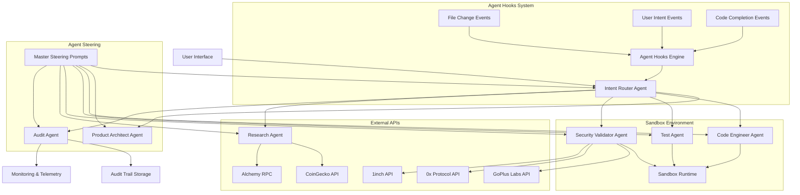

# Design Document: Multi-Agent Autonomous Engineering System

## Overview

The Multi-Agent Autonomous Engineering System is a sophisticated 7-agent platform that orchestrates autonomous software development workflows with specialized focus on DeFi safety, security validation, and enterprise-grade compliance. The system employs a distributed architecture where specialized agents collaborate through event-driven coordination, automated hooks, and master steering prompts to deliver comprehensive engineering capabilities.

The architecture follows established patterns from AutoGPT, Devin, and SWE-Agent while introducing novel DeFi-specific safety mechanisms and sandbox isolation protocols. Each agent operates within strictly defined boundaries, with the Intent Router serving as the central orchestrator that analyzes user requests and coordinates multi-agent workflows.

Key design principles include:
- **Autonomous Operation**: Agents operate independently within sandbox environments
- **Safety-First**: All DeFi operations undergo comprehensive security validation
- **Traceability**: Complete audit trails for all operations and decisions
- **Modularity**: Each agent has distinct responsibilities with clear interfaces
- **Scalability**: Event-driven architecture supports concurrent agent operations

## Architecture

### System Architecture Overview



### Agent Communication Protocol

Agents communicate through a structured message passing system with the following components:

1. **Intent Routing Protocol**: Standardized message format for agent coordination
2. **Event Bus**: Asynchronous communication channel for agent notifications
3. **Shared Context Store**: Centralized storage for workflow state and intermediate results
4. **Audit Channel**: Dedicated logging channel for all agent interactions

### Sandbox Architecture

The sandbox environment provides strict isolation with the following layers:

1. **Process Isolation**: Each agent runs in separate containerized processes
2. **Network Isolation**: Controlled access to external APIs through proxy layer
3. **File System Isolation**: Restricted access to designated workspace directories
4. **Resource Limits**: CPU, memory, and execution time constraints
5. **Permission Model**: Role-based access control for agent capabilities

## Components and Interfaces

### 1. Intent Router Agent

**Purpose**: Central orchestrator that analyzes user intent and coordinates agent workflows.

**Core Capabilities**:
- Natural language intent parsing and classification
- Multi-agent workflow orchestration and dependency management
- Context-aware agent selection based on request complexity
- Conflict resolution and resource allocation

**Interface Specification**:
```typescript
interface IntentRouterAgent {
  analyzeIntent(userInput: string): IntentAnalysis
  routeToAgents(intent: IntentAnalysis): AgentWorkflow
  orchestrateWorkflow(workflow: AgentWorkflow): ExecutionPlan
  monitorExecution(plan: ExecutionPlan): ExecutionStatus
}

interface IntentAnalysis {
  primaryIntent: IntentCategory
  secondaryIntents: IntentCategory[]
  complexity: ComplexityLevel
  requiredAgents: AgentType[]
  estimatedDuration: number
  riskLevel: RiskLevel
}
```

**Integration Points**:
- Receives user input from UI layer
- Coordinates with all other agents through message bus
- Interfaces with Agent Hooks system for event-driven activation
- Reports to Audit Agent for traceability

### 2. Product Architect Agent

**Purpose**: Generates system designs, UX flows, and technical specifications.

**Core Capabilities**:
- System architecture design and component specification
- User experience flow creation and interaction design
- Technical requirement analysis and specification generation
- Design pattern recommendation and best practice enforcement

**Interface Specification**:
```typescript
interface ProductArchitectAgent {
  generateArchitecture(requirements: Requirements): SystemArchitecture
  createUXFlows(userStories: UserStory[]): UXFlowDiagram
  specifyComponents(architecture: SystemArchitecture): ComponentSpec[]
  validateDesign(design: SystemDesign): ValidationResult
}

interface SystemArchitecture {
  components: Component[]
  interfaces: Interface[]
  dataFlow: DataFlowDiagram
  deploymentModel: DeploymentSpec
  scalabilityConsiderations: ScalabilityPlan
}
```

**Integration Points**:
- Receives design requests from Intent Router
- Collaborates with Research Agent for technology recommendations
- Provides specifications to Code Engineer for implementation
- Documents decisions through Audit Agent

### 3. Autonomous Code Engineer

**Purpose**: Generates, refactors, and maintains code autonomously within sandbox constraints.

**Core Capabilities**:
- Complete code generation from specifications
- Intelligent refactoring and code optimization
- Version control integration and branch management
- Code quality enforcement and standards compliance

**Interface Specification**:
```typescript
interface CodeEngineerAgent {
  generateCode(specification: CodeSpec): GeneratedCode
  refactorCode(codebase: Codebase, improvements: Improvement[]): RefactoredCode
  optimizePerformance(code: Code): OptimizedCode
  enforceStandards(code: Code, standards: CodingStandards): StandardizedCode
}

interface GeneratedCode {
  files: CodeFile[]
  dependencies: Dependency[]
  buildConfiguration: BuildConfig
  documentation: Documentation
  testSuggestions: TestSuggestion[]
}
```

**Integration Points**:
- Operates within Sandbox Environment with restricted permissions
- Receives specifications from Product Architect Agent
- Collaborates with Test Agent for quality assurance
- Subject to Security Validator approval for sensitive operations

### 4. Test & Auto-Fix Agent

**Purpose**: Creates comprehensive test suites and automatically debugs and fixes issues.

**Core Capabilities**:
- Automated test generation (unit, integration, property-based)
- Intelligent debugging and root cause analysis
- Iterative auto-fix loops with validation
- Test coverage analysis and gap identification

**Interface Specification**:
```typescript
interface TestAgent {
  generateTests(code: Code, coverage: CoverageRequirements): TestSuite
  debugIssues(failures: TestFailure[]): DebugAnalysis
  applyFixes(issues: Issue[]): FixResult
  validateFixes(fixes: Fix[]): ValidationResult
}

interface TestSuite {
  unitTests: UnitTest[]
  integrationTests: IntegrationTest[]
  propertyTests: PropertyTest[]
  coverageReport: CoverageReport
  executionPlan: TestExecutionPlan
}
```

**Integration Points**:
- Tests code generated by Code Engineer Agent
- Coordinates with Security Validator for security test validation
- Reports results to Audit Agent for quality metrics
- Triggers auto-fix loops until success criteria met

### 5. Security & DeFi Validator Agent

**Purpose**: Comprehensive security validation with specialized DeFi safety calculations.

**Core Capabilities**:
- DeFi transaction safety analysis (slippage, rug pull, honeypot detection)
- Smart contract security auditing and vulnerability assessment
- Transaction simulation and gas optimization
- MEV protection and sandwich attack prevention

**Interface Specification**:
```typescript
interface SecurityValidatorAgent {
  validateDeFiTransaction(transaction: DeFiTransaction): SecurityAssessment
  detectRugPull(contractAddress: string): RugPullAnalysis
  calculateSlippage(trade: TradeParams): SlippageCalculation
  simulateTransaction(tx: Transaction): SimulationResult
  assessContractSecurity(contract: SmartContract): SecurityAudit
}

interface SecurityAssessment {
  riskLevel: RiskLevel
  vulnerabilities: Vulnerability[]
  recommendations: SecurityRecommendation[]
  approvalRequired: boolean
  blockingIssues: BlockingIssue[]
}
```

**Integration Points**:
- Validates all DeFi operations before execution
- Integrates with GoPlus Labs, 0x, 1inch, and other security APIs
- Blocks unsafe operations and requires human approval for high-risk actions
- Provides security metrics to Audit Agent

### 6. Knowledge & Research Agent

**Purpose**: Conducts deep research and manages API integrations for comprehensive information gathering.

**Core Capabilities**:
- Automated research and information synthesis
- API discovery, integration, and management
- Data source verification and citation management
- Knowledge base maintenance and updates

**Interface Specification**:
```typescript
interface ResearchAgent {
  conductResearch(query: ResearchQuery): ResearchResults
  integrateAPI(apiSpec: APISpecification): APIIntegration
  verifyInformation(claims: Claim[]): VerificationResult
  synthesizeFindings(sources: InformationSource[]): SynthesizedReport
}

interface ResearchResults {
  findings: Finding[]
  sources: Source[]
  citations: Citation[]
  confidence: ConfidenceLevel
  recommendations: Recommendation[]
}
```

**Integration Points**:
- Supports all agents with research and data gathering
- Manages connections to external APIs (CoinGecko, Chainlink, etc.)
- Ensures compliance with anti-plagiarism requirements
- Provides verified information to other agents

### 7. Execution & Audit Agent

**Purpose**: Maintains comprehensive audit trails, monitoring, and system explainability.

**Core Capabilities**:
- Immutable audit trail generation and maintenance
- Real-time system monitoring and performance tracking
- Decision explainability and reasoning documentation
- Compliance reporting and regulatory adherence

**Interface Specification**:
```typescript
interface AuditAgent {
  logOperation(operation: Operation): AuditEntry
  trackDecision(decision: Decision, reasoning: Reasoning): DecisionLog
  generateReport(timeframe: TimeRange, scope: AuditScope): AuditReport
  monitorPerformance(metrics: PerformanceMetrics): MonitoringAlert[]
}

interface AuditEntry {
  timestamp: Timestamp
  agentId: AgentId
  operation: OperationType
  inputs: InputData
  outputs: OutputData
  reasoning: ReasoningChain
  riskAssessment: RiskAssessment
}
```

**Integration Points**:
- Receives logs from all agents in the system
- Provides audit data for compliance and debugging
- Monitors system health and performance metrics
- Generates reports for human oversight and regulatory compliance

## Data Models

### Core System Entities

```typescript
// User and Session Management
interface User {
  id: UserId
  profile: UserProfile
  permissions: Permission[]
  sessionHistory: Session[]
  preferences: UserPreferences
}

interface Session {
  id: SessionId
  userId: UserId
  startTime: Timestamp
  endTime?: Timestamp
  activities: Activity[]
  riskLevel: RiskLevel
}

// Agent Workflow Management
interface AgentWorkflow {
  id: WorkflowId
  initiatingAgent: AgentId
  participatingAgents: AgentId[]
  steps: WorkflowStep[]
  status: WorkflowStatus
  dependencies: Dependency[]
  outputs: WorkflowOutput[]
}

interface WorkflowStep {
  id: StepId
  agentId: AgentId
  action: ActionType
  inputs: StepInput[]
  outputs: StepOutput[]
  status: StepStatus
  executionTime: Duration
  retryCount: number
}

// DeFi-Specific Data Models
interface DeFiTransaction {
  id: TransactionId
  type: TransactionType
  fromToken: Token
  toToken: Token
  amount: BigNumber
  slippageTolerance: Percentage
  gasLimit: BigNumber
  gasPrice: BigNumber
  deadline: Timestamp
  securityAssessment: SecurityAssessment
}

interface Token {
  address: ContractAddress
  symbol: string
  name: string
  decimals: number
  totalSupply: BigNumber
  securityFlags: SecurityFlag[]
  liquidityMetrics: LiquidityMetrics
}

interface SecurityAssessment {
  rugPullRisk: RiskLevel
  honeypotDetected: boolean
  liquidityLocked: boolean
  ownerPrivileges: OwnerPrivilege[]
  transferTax: Percentage
  priceImpact: Percentage
  mevRisk: RiskLevel
}

// Code and Development Models
interface Codebase {
  id: CodebaseId
  repository: RepositoryInfo
  files: CodeFile[]
  dependencies: Dependency[]
  testSuite: TestSuite
  securityScan: SecurityScanResult
  qualityMetrics: QualityMetrics
}

interface CodeFile {
  path: FilePath
  content: string
  language: ProgrammingLanguage
  lastModified: Timestamp
  author: AgentId
  testCoverage: Percentage
  securityIssues: SecurityIssue[]
}

// Audit and Compliance Models
interface AuditTrail {
  entries: AuditEntry[]
  startTime: Timestamp
  endTime: Timestamp
  scope: AuditScope
  complianceStatus: ComplianceStatus
  violations: ComplianceViolation[]
}

interface ComplianceViolation {
  id: ViolationId
  type: ViolationType
  severity: Severity
  description: string
  timestamp: Timestamp
  agentId: AgentId
  remediation: RemediationAction[]
}

// Agent Hook and Steering Models
interface AgentHook {
  id: HookId
  name: string
  description: string
  triggerEvents: EventType[]
  conditions: HookCondition[]
  actions: HookAction[]
  enabled: boolean
  priority: Priority
}

interface AgentSteering {
  agentType: AgentType
  masterPrompt: string
  operationalLimits: OperationalLimit[]
  safetyConstraints: SafetyConstraint[]
  qualityStandards: QualityStandard[]
  escalationRules: EscalationRule[]
}
```

### API Integration Models

```typescript
// External API Integration
interface APIIntegration {
  id: IntegrationId
  provider: APIProvider
  endpoint: URL
  authentication: AuthenticationMethod
  rateLimits: RateLimit[]
  responseSchema: JSONSchema
  errorHandling: ErrorHandlingStrategy
}

interface DeFiAPIResponse {
  provider: APIProvider
  data: any
  timestamp: Timestamp
  confidence: ConfidenceLevel
  cacheExpiry: Timestamp
  validationStatus: ValidationStatus
}

// Supported API Providers
enum APIProvider {
  GOPLUS_LABS = "goplus_labs",
  ZERO_X = "0x",
  ONE_INCH = "1inch",
  PARASWAP = "paraswap",
  COINGECKO = "coingecko",
  CHAINLINK = "chainlink",
  ETHERSCAN = "etherscan",
  THE_GRAPH = "the_graph",
  ALCHEMY = "alchemy",
  INFURA = "infura",
  TENDERLY = "tenderly"
}
```

## Correctness Properties

*A property is a characteristic or behavior that should hold true across all valid executions of a system—essentially, a formal statement about what the system should do. Properties serve as the bridge between human-readable specifications and machine-verifiable correctness guarantees.*

Based on the prework analysis of acceptance criteria, the following properties have been identified as testable through property-based testing. These properties ensure the system behaves correctly across all valid inputs and scenarios.

### Property 1: Intent Analysis and Routing Consistency
*For any* user input, the Intent_Router should consistently analyze the request, identify the primary intent category, and route to appropriate agents while logging all routing decisions with reasoning for audit purposes.
**Validates: Requirements 1.1, 1.2, 1.4, 1.5**

### Property 2: Ambiguous Intent Clarification
*For any* ambiguous user input, the Intent_Router should request clarification before proceeding rather than making assumptions or guessing the intended action.
**Validates: Requirements 1.3**

### Property 3: Product Architecture Generation Completeness
*For any* valid design requirements, the Product_Architect should generate comprehensive system architecture including DeFi-specific patterns, Web2 compatibility, and documented rationale for all design decisions.
**Validates: Requirements 2.1, 2.2, 2.3, 2.4, 2.5**

### Property 4: Code Generation Quality and Standards
*For any* code generation request, the Code_Engineer should produce complete, runnable implementations that follow established coding standards, integrate with version control, and maintain code history.
**Validates: Requirements 3.1, 3.4, 3.5**

### Property 5: Code Refactoring Functionality Preservation
*For any* code refactoring operation, the Code_Engineer should improve code structure while preserving the original functionality and behavior of the system.
**Validates: Requirements 3.2**

### Property 6: Sandbox Security Isolation
*For any* operation in autonomous mode, the Sandbox_Environment should prevent all access to production systems, enforce resource limits, ensure client-side key handling, and maintain complete isolation between sandbox and live environments.
**Validates: Requirements 3.3, 10.1, 10.3, 10.4, 10.6**

### Property 7: Comprehensive Test Generation and Coverage
*For any* written code, the Test_Agent should automatically generate comprehensive test suites that achieve minimum 80% code coverage and include appropriate test types.
**Validates: Requirements 4.1, 4.4**

### Property 8: Automated Bug Diagnosis and Fix Loops
*For any* detected bug or test failure, the Test_Agent should diagnose issues, apply fixes iteratively, and continue auto-fix loops until success or escalation threshold is reached.
**Validates: Requirements 4.2, 4.3, 4.5**

### Property 9: Comprehensive DeFi Security Validation
*For any* DeFi transaction or contract interaction, the Security_Validator should calculate slippage and price impact, detect rug pull and honeypot risks, identify transfer fees, verify liquidity locks and ownership privileges, and detect MEV vulnerabilities.
**Validates: Requirements 5.1, 5.2, 5.3, 5.6, 5.8**

### Property 10: Transaction Simulation and Risk Blocking
*For any* transaction, the Security_Validator should simulate execution before proceeding and block transactions when security risks are identified while providing explanations.
**Validates: Requirements 5.4, 5.5**

### Property 11: Gas Optimization
*For any* gas estimation, the Security_Validator should optimize for cost efficiency and route through the cheapest available options.
**Validates: Requirements 5.7, 12.6**

### Property 12: Research Information Gathering and Citation
*For any* research query, the Research_Agent should conduct comprehensive information gathering, provide citations and source verification, and maintain compliance with anti-plagiarism requirements.
**Validates: Requirements 6.1, 6.4, 6.5**

### Property 13: API Integration Compliance
*For any* API integration need, the Research_Agent should identify appropriate endpoints and use only verified free APIs including 0x, 1inch, GoPlus Labs, CoinGecko, Etherscan, The Graph, Alchemy, and Infura with proper rate limit handling.
**Validates: Requirements 6.2, 6.3, 13.1, 13.2, 13.3, 13.4, 13.5, 13.6, 13.7, 13.8**

### Property 14: Comprehensive Audit Trail Generation
*For any* agent action or decision, the Audit_Agent should log all operations with timestamps, record reasoning and data sources, maintain immutable audit trails for financial operations, and document approval workflows.
**Validates: Requirements 7.1, 7.2, 7.3, 7.4**

### Property 15: Real-time System Monitoring
*For any* system operation, the Audit_Agent should provide real-time monitoring of system performance and resource usage.
**Validates: Requirements 7.5**

### Property 16: Event-Driven Agent Activation
*For any* file change, user intent detection, code completion event, or security validation need, the Agent_Hook should trigger appropriate agents, activate relevant workflows, initiate testing sequences, and engage security agents based on configurable rules.
**Validates: Requirements 8.1, 8.2, 8.3, 8.4, 8.5**

### Property 17: Agent Steering and Safety Enforcement
*For any* agent operation, the Agent_Steering should provide appropriate master prompts, enforce safety boundaries and operational limits in autonomous mode, implement intent-based routing logic, enforce correction loops for quality issues, and maintain transparency standards.
**Validates: Requirements 9.1, 9.2, 9.3, 9.4, 9.5**

### Property 18: Production Deployment Human Approval
*For any* production deployment request, the Sandbox_Environment should require human approval before proceeding.
**Validates: Requirements 10.5**

### Property 19: DeFi Transaction Validation Without Execution
*For any* DeFi operation in sandbox mode, the Sandbox_Environment should validate transactions without executing them on live networks.
**Validates: Requirements 10.2**

### Property 20: Multi-Platform Integration Support
*For any* integration scenario, the System should support both DeFi protocols and traditional Web2 API integrations while maintaining compatibility with industry standards including AutoGPT, Devin, and SWE-Agent architectures.
**Validates: Requirements 11.1, 11.5**

### Property 21: User Experience Accessibility
*For any* non-technical user interaction, the System should provide simplified interfaces and explanations while meeting enterprise standards suitable for grants, investors, and hackathon environments.
**Validates: Requirements 11.2, 11.3**

### Property 22: Complex Workflow Progress Reporting
*For any* complex workflow execution, the System should provide progress updates and status information throughout the process.
**Validates: Requirements 11.4**

### Property 23: Comprehensive DeFi Safety Calculations
*For any* DeFi operation, the System should calculate slippage between expected and executed prices, compute price impact for large trades, detect rug pull risks through ownership analysis, identify honeypot mechanisms, verify liquidity locks, simulate all transactions before execution, identify hidden token taxes, and detect price manipulation attacks.
**Validates: Requirements 12.1, 12.2, 12.3, 12.4, 12.5, 12.7, 12.9, 12.10**

### Property 24: MEV Protection and Sandwich Attack Mitigation
*For any* transaction with MEV risks present, the System should detect and mitigate sandwich attack vulnerabilities.
**Validates: Requirements 12.8**

## Error Handling

The Multi-Agent Autonomous Engineering System implements comprehensive error handling across all agents and operational modes:

### Agent-Level Error Handling

**Intent Router Agent**:
- Graceful handling of malformed or incomplete user inputs
- Fallback mechanisms for agent unavailability or overload
- Timeout handling for long-running agent coordination tasks
- Escalation protocols for unresolvable intent conflicts

**Code Engineer Agent**:
- Compilation error detection and automatic retry with corrections
- Dependency resolution failure handling with alternative suggestions
- Version control conflict resolution and merge strategies
- Resource exhaustion handling with cleanup and retry mechanisms

**Security Validator Agent**:
- API failure fallbacks with cached security data when available
- Network timeout handling for external security service calls
- Invalid contract address handling with user notification
- Rate limit exceeded scenarios with exponential backoff

### System-Level Error Handling

**Sandbox Isolation Failures**:
- Immediate operation termination if sandbox boundaries are breached
- Automatic rollback of any partial operations in compromised environments
- Alert generation for security team investigation
- Quarantine procedures for affected agent instances

**External API Failures**:
- Circuit breaker patterns to prevent cascade failures
- Graceful degradation with reduced functionality when APIs are unavailable
- Automatic failover to backup API providers where available
- User notification of service limitations during outages

**Resource Exhaustion**:
- Automatic scaling of agent instances based on workload
- Priority-based task queuing during high-load scenarios
- Resource cleanup and garbage collection for long-running operations
- Emergency shutdown procedures for critical resource depletion

### Recovery Mechanisms

**State Recovery**:
- Checkpoint-based recovery for long-running multi-agent workflows
- Transaction log replay for financial operation recovery
- Incremental backup of agent state and workflow progress
- Rollback capabilities for failed operations with side effects

**Data Consistency**:
- Distributed transaction coordination across agents
- Conflict resolution for concurrent agent operations
- Data validation and integrity checks at agent boundaries
- Automatic repair mechanisms for corrupted workflow state

## Testing Strategy

The Multi-Agent Autonomous Engineering System employs a dual testing approach combining unit testing and property-based testing to ensure comprehensive coverage and correctness validation.

### Property-Based Testing Implementation

**Framework Selection**: The system uses Hypothesis (Python), fast-check (TypeScript/JavaScript), or QuickCheck (Haskell) depending on the implementation language chosen during task creation.

**Test Configuration**:
- Minimum 100 iterations per property test to ensure statistical confidence
- Each property test references its corresponding design document property
- Tag format: **Feature: multi-agent-autonomous-engineering, Property {number}: {property_text}**
- Randomized input generation covering edge cases and boundary conditions

**Property Test Categories**:

1. **Intent Routing Properties**: Test intent analysis consistency across diverse user inputs
2. **Agent Coordination Properties**: Validate multi-agent workflow orchestration
3. **Security Validation Properties**: Ensure DeFi safety calculations across all transaction types
4. **Sandbox Isolation Properties**: Verify security boundaries under all operational conditions
5. **API Integration Properties**: Test external service integration reliability
6. **Audit Trail Properties**: Validate logging and traceability across all operations

**Generator Strategies**:
- **User Input Generators**: Create diverse natural language inputs including ambiguous cases
- **DeFi Transaction Generators**: Generate valid and invalid transaction parameters
- **Code Structure Generators**: Create various code patterns for testing refactoring
- **API Response Generators**: Simulate different API response scenarios including failures

### Unit Testing Strategy

**Focused Testing Areas**:
- Specific examples demonstrating correct behavior for each agent
- Integration points between agents and external services
- Edge cases and error conditions not covered by property tests
- Performance benchmarks for critical operations

**Test Organization**:
- Agent-specific test suites for individual component validation
- Integration test suites for multi-agent workflow validation
- End-to-end test suites for complete user journey validation
- Security test suites for DeFi-specific safety validations

**Mock and Stub Strategy**:
- External API mocking for reliable test execution
- Agent behavior simulation for isolated component testing
- Sandbox environment simulation for security testing
- Time-based operation mocking for deterministic testing

### Continuous Integration and Quality Gates

**Automated Testing Pipeline**:
- Pre-commit hooks running fast unit tests and linting
- Pull request validation with full test suite execution
- Nightly property-based test runs with extended iteration counts
- Performance regression testing for critical paths

**Quality Metrics**:
- Minimum 80% code coverage requirement across all agents
- Property test pass rate of 100% across all defined properties
- Security scan pass rate of 100% for all generated code
- Performance benchmarks within defined SLA thresholds

**Deployment Gates**:
- All tests must pass before deployment to any environment
- Security validation required for all DeFi-related components
- Human approval required for production deployments
- Rollback procedures tested and validated for all deployment scenarios

### Testing in Production

**Monitoring and Observability**:
- Real-time monitoring of property violations in production
- Automated alerting for security validation failures
- Performance monitoring with automatic scaling triggers
- User experience monitoring with feedback collection

**Canary Deployments**:
- Gradual rollout of new agent versions with monitoring
- Automatic rollback triggers based on error rates or performance degradation
- A/B testing for agent behavior improvements
- Feature flags for controlled feature activation

The testing strategy ensures that the Multi-Agent Autonomous Engineering System maintains high reliability, security, and performance standards while providing comprehensive validation of all correctness properties defined in this design document.